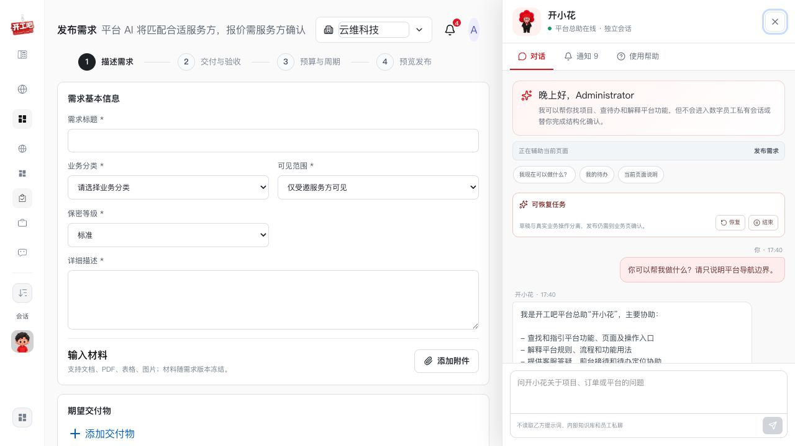
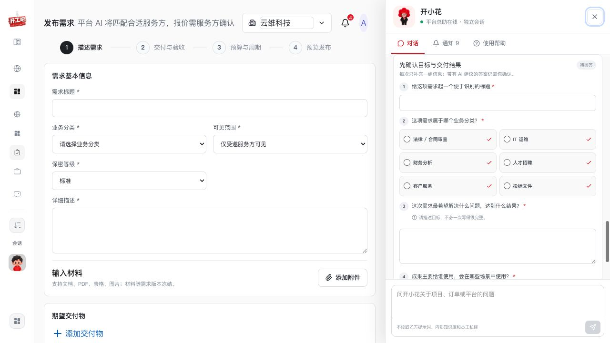
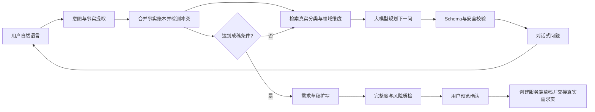

# 开小花自适应需求访谈重构依据

> 文档编号：KX-AR-001<br>
> 日期：2026-08-04<br>
> 状态：产品方向已确认，待六个核心 UI 状态确认后实施<br>
> 目标：把“固定问题表单”重构为“AI 主动分析、渐进追问、自动成稿”的需求访谈

## 1. 审计范围

本次只审计开小花从自然语言识别需求、收集信息、形成草稿并交接真实需求发布页的流程，不调整订单、交付、争议、支付、StaffDeck 原有功能或全局页面结构。

用户目标：只需自然描述想做的事情，由开小花判断还缺什么、主动追问、整理成完整需求，并自动填入真实需求发布页；用户主要负责回答、纠错和最终确认，而不是重新填写一遍表单。

### 证据 1：开小花与真实需求表并列



健康度：基础安全边界、独立抽屉和真实需求页面衔接正确；但聊天尚未承担需求分析工作。

### 证据 2：当前固定问题卡片



健康度：结构化控件、必填校验和可访问语义可复用；但一次展示多个固定字段，本质上是把发布表复制进聊天框。

## 2. 核心结论

原产品依据已经要求“问题规划根据能力 Schema 和缺失字段生成问题组”，实现却变成了固定模板。当前大模型只参与：

1. 意图识别。
2. 从用户原话提取候选事实。
3. 根据已确认事实扩写草稿。

真正决定“问什么、先问什么、是否还要问”的逻辑由 `plan_fixed_questions()` 和 `_QUESTION_GROUPS` 固定控制，导致不同需求得到几乎相同的访谈。这是实现偏差，不是原产品目标。

正确原则应为：

> **大模型负责理解需求、分析信息缺口和规划下一问；服务端负责允许字段、数据来源、权限、风险、硬事实确认、状态机和最终写入。**

不能改成“大模型任意发挥”，也不能继续“服务端固定问卷”。正确形态是 **AI 驱动、Schema 约束、真实数据校验**。

## 3. 目标体验

### 3.1 对话优先，表单最后出现

用户输入“做 PPT”后，开小花不展示需求标题、分类、目标、使用场景四个输入框，而应先回应：

> 可以。为了判断这份 PPT 应该怎么做，我先确认最影响内容结构的一点：它主要用于什么场景？

快捷答案可以是：

- 融资路演
- 工作汇报
- 产品发布
- 培训课件
- 销售提案
- 其他，我直接说明

用户始终可以自然语言回答，快捷答案只是降低输入成本，不是固定表单。

### 3.2 每轮问最有价值的问题

问题优先级按“信息增益”决定：某个答案是否会显著改变服务范围、交付物、工期、预算或验收标准。

以 PPT 为例：

1. 使用场景决定内容结构，因此先问。
2. 是否已有文案/数据决定是“仅设计”还是“策划+撰写+设计”，因此第二问。
3. 受众、页数、风格和品牌材料决定设计范围，可在同一主题下询问。
4. 截止时间和预算是硬事实，靠后确认但发布前必须明确或标记待定。
5. 分类由系统检索和模型判断，不默认要求用户选择。

### 3.3 已经说过的信息不再询问

用户说“做一份给董事会汇报的 20 页年度经营 PPT，下周五要”，系统应直接建立以下事实：

- 交付物类型：PPT。
- 使用场景：年度经营汇报。
- 受众：董事会。
- 页数：约 20 页。
- 截止时间：下周五（转为具体日期后让用户确认）。

下一问应该是“是否已有完整文案和数据”，而不是再次询问标题、使用对象和截止时间。

### 3.4 达到可成稿条件后停止追问

第一版需求草稿的停止条件不是“所有表单字段都填写完成”，而是：

1. 用户目标明确。
2. 至少一个核心交付物明确。
3. 使用对象或场景明确。
4. 服务范围大致明确。
5. 工期已确认或明确标记待定。

非阻塞信息可以由 AI 给出建议，并在预览中标记“待确认”；不得为追求 100% 完整度无限提问。

## 4. 目标对话示例

### 第 1 轮

用户：做 PPT。

开小花：可以。这份 PPT 主要用于什么场景？场景不同，内容结构和设计重点会不同。

### 第 2 轮

用户：给投资人看的融资路演，两周后使用。

系统提取：场景=融资路演；受众=投资人；工期=两周。<br>
系统分类候选：设计与创意 / 演示文稿设计；商业服务 / 融资材料。

开小花：明白，是两周后给投资人使用的融资路演。你现在已有商业计划书、财务数据或完整文案吗？

### 第 3 轮

用户：有商业计划书和财务数据，但没有成型文案，也没有设计规范。

开小花：那服务范围需要包含内容梳理、路演结构、文案精简和视觉设计。预计希望控制在多少页？风格更偏专业稳重、科技感，还是简洁现代？

### 第 4 轮

用户：20 页左右，科技感，不要太花。

开小花：收到。最后确认两项发布所需信息：预算范围是多少？材料是否只允许受邀服务方查看？

### 成稿

开小花展示完整需求预览：

- 标题：融资路演 PPT 内容策划与视觉设计
- 分类：演示文稿设计（系统匹配）
- 背景和目标：AI 根据已确认事实整理
- 服务范围：结构梳理、文案精简、20 页左右视觉设计
- 排除项：未确认时明确显示“待补充”，不擅自添加
- 交付物：可编辑 PPTX、PDF 预览稿、所用字体/素材说明
- 验收标准：页数范围、可编辑性、内容完整性、风格一致性
- 工期：两周
- 预算、可见范围、保密要求：用户确认的硬事实

用户点击“写入需求发布页”后，系统创建真实服务端草稿并打开需求发布页。发布按钮仍由用户操作。

## 5. UI 设计

### 5.1 对话中的标准组成

每轮只出现以下内容：

1. 开小花对用户上一轮的简短理解。
2. 一个主问题；必要时最多附带一个同主题问题。
3. 2–6 个根据当前需求动态生成的快捷答案。
4. “我直接说明”“还不确定，请给建议”入口。
5. 折叠的“已了解信息”摘要。

不再默认展示四个长输入框，也不要求用户先给需求起标题或选择业务分类。

### 5.2 已收集信息摘要

抽屉中显示轻量状态：

- 已了解：使用场景、目标受众、已有材料。
- 还需确认：服务范围、截止时间。
- 可稍后补充：预算、排除项。

事实可以点开修改；修改后系统重新计算后续问题和草稿，不覆盖历史版本。

### 5.3 最终预览

最终预览按真实需求字段分区，但不表现为第一次填写表单：

- “用户明确”：来自用户原话或用户选择。
- “AI 整理，待确认”：根据确认事实扩写。
- “系统匹配”：分类、企业主体等经真实数据服务校验的内容。
- “仍缺信息”：阻塞发布或仅作为提醒。

主要按钮：

- 写入需求发布页。
- 修改某一项。
- 继续补充。
- 暂存并稍后继续。

禁止在开小花中直接显示“发布成功”，除非用户已经进入真实业务页并亲自确认发布。

## 6. 分类体系设计

### 6.1 当前问题

当前开小花问题卡和需求发布页均写死六个分类。交易核心实际上只保存分类字符串，没有正式的分类目录、ID、层级、别名和版本，因此无法可靠自动归类。

### 6.2 正确数据模型

新增正式分类目录：

| 字段 | 说明 |
| --- | --- |
| `id` | 稳定分类 ID |
| `name` | 展示名称 |
| `parent_id` | 上级分类 |
| `description` | 分类适用范围 |
| `aliases` | 用户常用说法，如“做PPT”“路演稿” |
| `example_tasks` | 典型需求示例 |
| `required_facets` | 此类需求通常需要了解的维度 |
| `status` | 启用/停用 |
| `version` | 分类版本 |

需求记录同时保存 `category_id` 和成交时的 `category_name_snapshot`。旧数据继续保留原分类字符串，避免破坏已经跑通的交易流程。

### 6.3 自动分类流程

1. 用用户需求和已确认事实检索分类目录，返回 Top 5。
2. 大模型在候选范围内排序并给出置信度和原因码。
3. 高置信且唯一：自动选中，在预览中显示“系统匹配，可修改”。
4. 两个分类接近：用一句自然问题让用户确认业务方向。
5. 无合适分类：进入“其他/待归类”，记录建议标签供运营维护分类库。

分类不是开放给模型任意生成；模型只能选择真实目录中的 ID 或返回“无匹配”。

## 7. 后端编排设计

### 7.1 持久化事实账本

每个需求访谈工作流维护 `FactLedger`：

| 字段 | 说明 |
| --- | --- |
| `field` | 标准字段或领域维度 |
| `value` | 当前值 |
| `source` | 用户原话、用户选择、附件、AI 建议、系统记录 |
| `status` | 候选、已确认、冲突、已废弃 |
| `confidence` | 提取置信度 |
| `evidence_ref` | 原消息或附件引用 |
| `hard_fact` | 是否必须用户确认 |
| `version` | 事实版本 |

每轮先更新事实账本，再决定下一问。不得仅把答案存在前端组件状态中。

### 7.2 模型结构化输出

问题规划模型只返回受控 JSON，例如：

```json
{
  "understanding_summary": "需要制作一份PPT，但使用场景尚未明确",
  "new_fact_candidates": [
    {
      "field": "deliverable.type",
      "value": "PPT",
      "source_message_id": "msg_123",
      "confidence": 0.99,
      "hard_fact": false
    }
  ],
  "category_candidates": [],
  "missing_information": [
    {
      "field": "use_scenario",
      "importance": "blocking",
      "reason_code": "CHANGES_CONTENT_STRUCTURE"
    }
  ],
  "next_question": {
    "target_fields": ["use_scenario"],
    "question": "这份PPT主要用于什么场景？",
    "answer_mode": "choice_or_free_text",
    "suggested_options": ["融资路演", "工作汇报", "产品发布", "培训课件", "销售提案"],
    "allow_uncertain": true
  },
  "draft_readiness": {
    "ready": false,
    "blocking_fields": ["use_scenario", "deliverables", "schedule"]
  }
}
```

服务端必须校验：

- `target_fields` 位于允许字段或当前分类允许的领域维度中。
- 选项数量、长度、敏感信息和问题数量符合规则。
- 模型不能把分类、金额、日期、企业或权限直接标记为用户已确认。
- 模型不能返回发布、付款、签约、验收、退款、放款或裁决动作。

### 7.3 正确调用链



### 7.4 模型职责边界

模型负责：

- 理解用户目标。
- 提取候选事实。
- 判断哪些信息最影响后续方案。
- 生成自然、上下文相关的下一问和快捷选项。
- 推荐真实分类候选。
- 根据确认事实整理需求文案。

服务端负责：

- 字段和能力白名单。
- 用户、企业和租户权限。
- 事实来源、确认状态和版本。
- 真实分类目录检索与 ID 校验。
- 预算、日期、附件等硬事实校验。
- 幂等、审计、草稿写入和真实页面交接。
- 永久拦截 R3/R4 动作。

不展示或持久化模型的完整思维链，只保存可审计的事实来源、缺口字段、分类候选、问题目标和原因码。

## 8. 对当前代码的具体改造

### 8.1 保留

- 全局开小花抽屉和会话隔离。
- 已冻结的风险矩阵、路由白名单和结构化 Block 信封。
- 服务端草稿、版本、审计、AI 用量和真实需求页接力。
- `QuestionGroupBlock` 的输入控件和可访问语义，作为动态问题的渲染器。
- AI 不可用时的固定安全降级问题。

### 8.2 替换

- `plan_fixed_questions()` 替换为 `plan_next_questions()`。
- `_QUESTION_GROUPS` 从默认流程降级为“模型不可用/人工模式”的兜底模板。
- 当前仅做意图和事实提取的编排器，增加真实 `QUESTION_PLANNING_SYSTEM_PROMPT` 与结构化输出模型。
- 每次固定返回 2–4 个问题，调整为默认 1 个主问题、最多 2 个同主题问题。
- 分类选择从固定选项改为真实分类目录候选。

### 8.3 新增

- `RequirementFactLedger` 和事实版本表。
- `ServiceCategory`、分类别名和领域维度表。
- `TaxonomyRetriever`。
- `AdaptiveQuestionPlanner`。
- `DraftReadinessEvaluator`。
- 模型超时、坏 JSON 和低置信分类的降级策略。
- 访谈指标：平均轮数、重复提问率、草稿采用率、人工改写率、分类纠正率。

## 9. 前端实现

现有 `question_group` v1 协议已经允许 1–4 个动态问题，因此首期可以保持协议兼容：后端每次只返回当前最重要的问题，选项由模型结合真实分类/领域上下文动态生成。

新增前端状态：

- 本轮理解摘要。
- 已提取事实胶囊。
- 仍缺关键内容。
- 问题正在分析。
- 分类系统匹配结果。
- 可成稿提示。

用户在主输入框中的自然语言回答和点击快捷选项都提交到同一工作流，不形成两套逻辑。

## 10. 安全与降级

1. 模型不可用：只询问目标、交付物、场景、工期四个最低问题，仍可手工成稿。
2. 模型输出不合法：修复一次；再次失败使用降级问题，不渲染坏 JSON。
3. 分类低置信：不强行归类，要求用户确认候选或使用待归类。
4. 用户输入冲突：明确指出“你之前说两周，现在说下周五”，要求确认，不能静默覆盖。
5. 硬事实：预算、日期、企业、权限、保密和附件范围必须由用户确认。
6. Prompt Injection：用户和附件均视为不可信内容，不能修改能力白名单或系统规则。

## 11. 开发阶段

### KX-R0：规格纠偏与目标 UI

- 修订原依据中的“问题规划”验收标准。
- 绘制自然语言启动、单问、快捷回答、事实摘要、冲突确认、最终预览六个状态。
- 确认后再改代码。

验收：不再出现与真实需求页重复的固定四字段卡片。

### KX-R1：分类目录与事实账本

- 建立正式分类数据和兼容迁移。
- 建立事实来源、确认、冲突和版本模型。
- 接入租户与企业隔离。

验收：旧需求不受影响；新需求可以保存分类 ID 和名称快照。

### KX-R2：自适应问题规划器

- 新增模型问题规划调用。
- 检索分类与领域维度。
- 动态生成下一问、选项和停止判断。
- 固定问题降级为兜底。

验收：“做PPT”“合同审查”“招聘流程”得到不同问题路径，已知信息不重复询问。

### KX-R3：对话式前端

- 调整问题卡为一轮一个主问题。
- 增加理解摘要、事实胶囊、修改和冲突状态。
- 保留键盘操作、屏幕阅读语义和移动端适配。

验收：用户可全程用自然语言，也可使用快捷答案；不存在必须在抽屉里填写长表单的路径。

### KX-R4：自动成稿与真实表单接力

- 根据确认事实扩写完整需求。
- 质检缺项、矛盾和不可验证描述。
- 创建真实服务端草稿并自动填入需求发布页。

验收：用户只需复核、修改和点击真实发布按钮。

### KX-R5：安全、用量与降级

- 覆盖注入、越权、坏 JSON、超时、备用模型和固定模板降级。
- 记录模型、Token、问题轮次、来源和草稿采用情况。

验收：AI 不可用时仍能完成最低可用草稿；任何 R3/R4 动作不可由模型执行。

### KX-R6：业务验收

- 多类型需求对话测试。
- 刷新、断线、跨标签恢复。
- 甲方成稿发布、乙方查看报价、甲方选标回归。
- 分类纠正、数据隔离和旧路由回归。

验收：自适应访谈和原交易链同时通过，再提交和部署。

## 12. 关键验收指标

- 重复提问率低于 2%。
- 简单需求 3–5 轮形成第一版草稿。
- 用户首次草稿采用率不低于 70%。
- 硬事实误填率为 0。
- 分类自动匹配后人工纠正率首期低于 20%，后续持续下降。
- 用户进入真实发布页后需要重新输入的核心字段不超过 1 项。
- 原手工发布和完整交易回归全部通过。

## 13. 结论

此次不应只修改提问文案或把四个问题拆成四条消息。必须重构“问题由谁决定”的核心机制：从固定模板决定问题，改为大模型基于事实账本、真实分类和信息缺口规划下一问；服务端继续掌握安全、权限、确认和写入。这样开小花才是真正的平台业务副驾，而不是嵌在聊天框中的第二份需求表。
