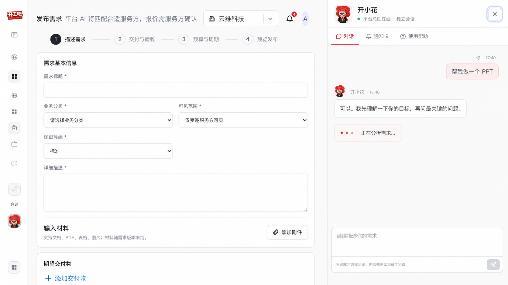
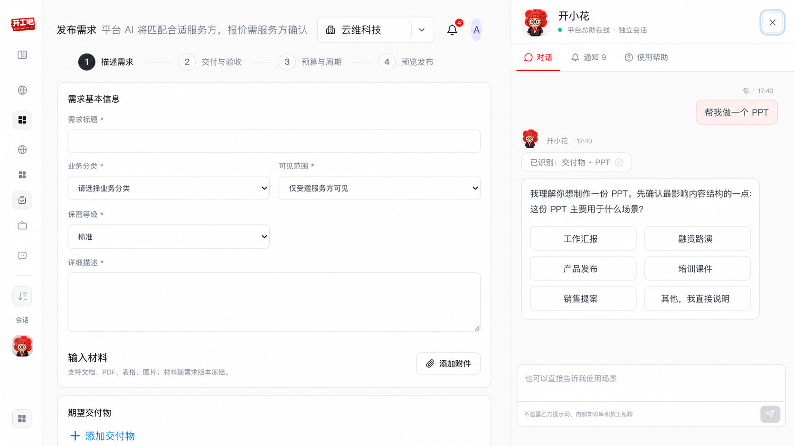
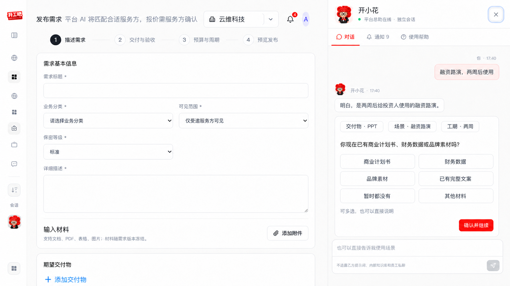
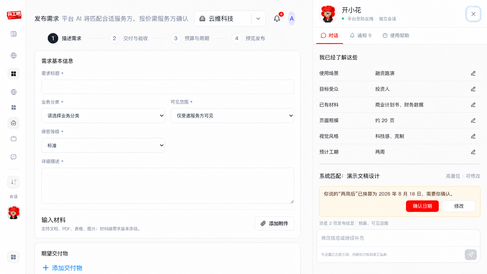
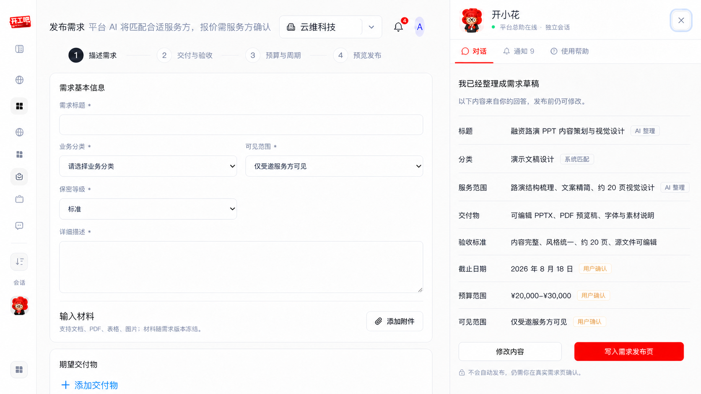
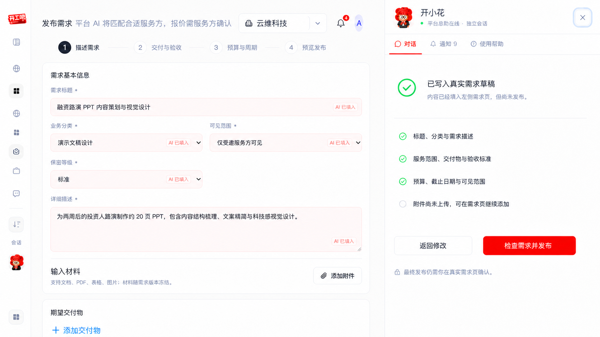

# 开小花自适应需求访谈：六个核心 UI 状态

> 状态：已绘制，待产品确认后进入 KX-R1～KX-R6 实现。

## 状态 1：自然语言启动

- 用户只需输入“帮我做一个 PPT”。
- 开小花先理解需求，不立即展示表单。
- 分析状态不承诺已经创建草稿。

## 状态 2：AI 理解与首个关键问题

- 已识别信息通过轻量事实标签展示。
- 每轮只问一个最影响后续方案的问题。
- 快捷答案由当前需求动态生成，用户仍可自由输入。

## 状态 3：根据回答动态追问

- 开小花先复述对上一轮的理解。
- 已经确认的场景和工期不重复询问。
- 下一问根据服务范围的信息增益产生。

## 状态 4：事实摘要、分类匹配与纠错

- 用户可以查看和修改已提取事实。
- 分类来自系统分类库匹配，不由前端写死。
- 日期等硬事实必须再次确认，不能由 AI 静默写入。

## 状态 5：完整需求预览

- 区分用户确认、AI 整理和系统匹配来源。
- 用户可以返回修改或继续补充。
- 开小花只能写入需求草稿，不能直接发布。

## 状态 6：写入真实需求页

- 左侧真实业务表单自动填入并保持可编辑。
- AI 填入字段有轻量来源提示。
- 附件等未完成内容明确列出。
- 最终发布必须由用户在真实需求页面确认。

## 确认后实施范围

1. 建立真实分类目录与事实账本。
2. 用大模型根据事实缺口生成下一问和快捷答案。
3. 将固定问题模板降级为 AI 不可用时的安全兜底。
4. 重构开小花问题区域，但不改变全局页面结构。
5. 保留服务端草稿、审计、权限和真实需求页接力。
