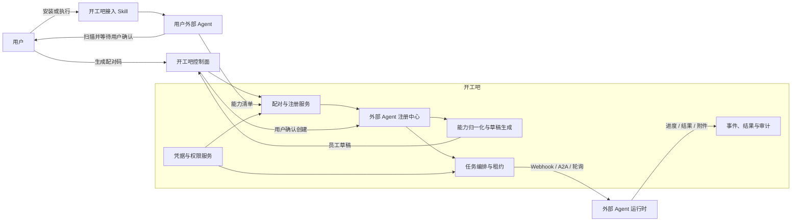

# 开工吧“外接 Agent”完整产品与技术方案

> 文档状态：评审稿
> 版本：V1.0
> 日期：2026-07-31
> 适用范围：开工吧数字员工平台、外部 Agent 接入、能力发现、任务执行与运营管理

## 1. 执行摘要

开工吧需要在“从广场招募”和“从空白创建”之外，增加第三种数字员工创建方式：

**外接已有 Agent。**

外接 Agent 不是把用户的 Agent 源码搬到开工吧运行，而是让用户已有的本地或云端 Agent 安装或执行一个统一的“开工吧接入 Skill”，由该 Agent：

1. 在用户授权范围内扫描自身身份、Skill、SOP、Tool、知识资源和运行能力；
2. 整理为开工吧规定的标准能力清单；
3. 在用户确认后主动注册到开工吧；
4. 继续在原有本地或云端环境中运行；
5. 从开工吧领取任务，并回传进度、结果、附件和审计事件。

整体架构遵循：

> 开工吧是控制面，用户 Agent 是执行面，接入 Skill 是注册与协作协议。

第一阶段不要求平台兼容每一家 Agent 的内部实现，而是先定义一套厂商无关的注册协议、能力清单和任务协议，再为 Codex、Coze、Kimi、WorkBuddy、自建 Agent 等提供不同的轻量适配方式。

---

## 2. 背景与问题

当前“新建数字员工”仅有：

- 从广场复制；
- 从空白开始。

两种方式都默认数字员工及其能力必须在开工吧内部产生，不能覆盖以下用户：

- 已经在本地使用 Codex、Claude Code 类 Agent 的个人或团队；
- 已经在 Coze 等云平台配置好智能体、插件和工作流的企业；
- 基于 Kimi、OpenAI 或其他模型 API 自建了 Agent 服务的开发者；
- 使用 WorkBuddy 等本地个人 Agent 的知识工作者；
- 已经拥有大量 `SKILL.md`、MCP、函数工具、Prompt 和工作流资产的组织。

这些用户不希望重新配置一个 Agent，也不希望把全部源码、知识和密钥上传到开工吧。他们需要的是：

1. 让现有 Agent 被平台识别；
2. 自动发现 Agent 已经具备的能力；
3. 自动生成平台所需的员工档案；
4. 让 Agent 继续在原环境执行；
5. 在开工吧统一派单、查看进度、管理权限和沉淀工作记录。

---

## 3. 产品目标与非目标

### 3.1 产品目标

本功能应实现：

1. **统一登记**
   本地和云端 Agent 都能以统一方式登记为开工吧数字员工。

2. **能力自发现**
   由用户自己的 Agent 在自身权限范围内发现 Skill、SOP、Tool 和知识资源。

3. **自动填充**
   将扫描结果转成数字员工姓名、职位、岗位描述、服务范围、能力清单和权限草稿。

4. **外部执行**
   任务仍由用户 Agent 在原环境执行，开工吧不接管其模型、密钥和运行环境。

5. **可观测和可治理**
   平台可以看到 Agent 在线状态、任务状态、进度、结果、失败原因和高风险操作确认。

6. **可扩展协议**
   新增厂商时只增加适配层，不重写整套接入和任务系统。

### 3.2 非目标

第一阶段不做：

- 自动复制无法导出的云端 Agent 内部实现；
- 绕过厂商权限读取用户工作区；
- 默认上传完整 Skill 源码、知识内容或密钥；
- 让平台任意远程控制用户电脑；
- 在现有无完整沙箱的环境中直接执行第三方脚本；
- 将所有 MCP Tool 自动包装成业务 Skill；
- 仅凭模型推测就把一个能力标记为已验证能力。

---

## 4. 核心概念与边界

### 4.1 AI 员工

AI 员工回答的是“谁在工作”。

它是一个持续存在、可管理、可派单、可考核的岗位主体，包含：

- 姓名和头像；
- 职位和岗位描述；
- 人设和服务风格；
- 服务范围和禁止事项；
- 模型或外部运行时；
- Skill、SOP、Tool 和知识资源绑定；
- 记忆、渠道和权限；
- 在线状态、排班和心跳；
- 工作记录、任务结果、评价和审计记录。

### 4.2 外部 Agent

外部 Agent 回答的是“在哪里运行、由谁真正执行”。

它可以是：

- 本地 Agent；
- 云端 SaaS Agent；
- 企业私有云 Agent；
- 自建 HTTP/A2A 服务；
- 可以被命令行或 SDK 调用的 Agent Runtime。

外部 Agent 可以对应一个开工吧 AI 员工，也可以由同一运行时承载多个 AI 员工。

### 4.3 接入 Skill

接入 Skill 是平台提供给用户 Agent 的“入职和协作说明书”，不是业务能力本身。

职责包括：

- 读取一次性配对信息；
- 扫描 Agent 自身能力；
- 生成标准能力清单；
- 向用户展示待上报内容；
- 注册和更新 Agent；
- 检查连接健康状态；
- 领取任务或接收任务；
- 上报任务事件和结果；
- 处理取消、超时和人工确认。

### 4.4 业务 Skill

业务 Skill 回答的是“这个员工会做什么”。

一个业务 Skill 应至少包含：

- 名称和描述；
- 适用场景；
- 输入和输出；
- 执行说明；
- 依赖的 Tool；
- 权限要求；
- 版本、来源和校验摘要；
- 可选的脚本、模板、参考资料和资产。

一个 AI 员工可以拥有多个 Skill，一个 Skill 也可以被多个 AI 员工复用。

### 4.5 SOP

SOP 回答的是“按什么步骤完成一项业务”。

它通常包含：

- 触发意图；
- 必需信息；
- 流程节点；
- 条件分支；
- 中断与恢复策略；
- 终止节点；
- 每一步允许使用的 Tool；
- 验收标准。

开工吧当前 `Skill` 数据结构实际更接近 SOP，后续产品命名应固定为“SOP”。

### 4.6 Tool

Tool 回答的是“通过什么接口完成一个原子动作”。

包括：

- MCP Tool；
- HTTP API；
- Function Calling；
- 命令行工具；
- 数据库查询；
- 浏览器或桌面操作；
- 厂商插件。

发现 Tool 不等于发现业务 Skill。平台可以基于多个 Tool 推测一个能力候选，但必须标记为“推测”，不能直接宣称为已验证 Skill。

### 4.7 知识资源

知识资源回答的是“执行工作时参考什么”。

默认只登记：

- 名称；
- 描述；
- 类型；
- 所属位置；
- 可访问范围；
- 内容摘要；
- 版本或更新时间。

除非用户明确选择上传，否则不上传知识正文。

---

## 5. 总体产品原则

### 5.1 用户 Agent 自发现

不由网页或平台后台静默扫描用户电脑，而由用户 Agent 在自己的环境中、按照用户授予的权限进行扫描。

### 5.2 默认登记，不默认复制

平台默认接收能力元数据，不接收完整源码。

资产状态分为：

| 状态 | 含义 |
|---|---|
| 已登记 | 平台知道该能力存在，但执行仍在外部 Agent |
| 可调用 | 平台可以通过外部 Agent 触发该能力 |
| 可导入 | 用户可以把能力包复制到开工吧 |
| 已导入 | Skill/SOP/Tool 已形成平台内部资源 |
| 不可导出 | 只能远程调用，不能获取内部定义 |
| 待验证 | 能力由模型或说明推测，尚未成功测试 |

### 5.3 明确授权

扫描前确认扫描范围，上传前展示完整清单，高风险权限单独确认。

### 5.4 每个字段可追溯

自动填充字段应保存：

- 原始来源；
- 原始证据；
- 生成方法；
- 可信度；
- 是否被用户修改；
- 最后同步时间。

### 5.5 外部执行优先

用户明确希望 Agent 自己运行时，平台不把 Skill 拉回本地执行。平台只进行派单、状态跟踪和结果管理。

### 5.6 人工确认后创建

扫描和模型整理只生成草稿，不能未经确认就创建员工、开放权限或上传资源。

---

## 6. 用户流程设计

### 6.1 创建入口

将当前二段式切换改成三张选择卡：

1. **从广场招募**
   复制平台内已有数字员工及其资源。

2. **外接已有 Agent**
   连接用户本地或云端 Agent，由 Agent 自己扫描、注册和执行。

3. **从空白创建**
   手工配置一个全新的平台数字员工。

在当前 520px 左右的弹窗中，不建议继续使用三个横向胶囊按钮，建议使用纵向卡片或进入独立向导页。

### 6.2 外接 Agent 向导

#### 第一步：选择接入方式

提供：

- 安装接入 Skill；
- 复制接入指令；
- 连接云端 Agent；
- 上传 Agent 能力清单；
- 高级方式：A2A、MCP、Webhook 或自定义 API。

系统生成：

- 一次性配对码；
- 接入 Skill 下载或安装命令；
- 可复制的接入指令；
- 配对二维码，可选；
- 过期时间；
- 当前授权范围。

#### 第二步：等待 Agent 扫描

页面显示实时状态：

- 等待 Agent 连接；
- 已建立安全连接；
- 正在读取 Agent 身份；
- 正在发现 Skill；
- 正在发现 Tool 和工作流；
- 正在检查依赖与风险；
- 等待用户在 Agent 端确认；
- 已收到能力清单。

允许用户关闭页面，任务在后台继续。

#### 第三步：审核发现结果

按类别展示：

- Agent 候选；
- 业务 Skill；
- SOP/工作流；
- Tool；
- 知识资源；
- 模型与运行时信息；
- 权限和风险。

每一项显示：

- 名称和描述；
- 类型；
- 来源；
- 是否可调用；
- 是否可导入；
- 风险级别；
- 依赖状态；
- 验证状态；
- 选择框。

#### 第四步：选择接入策略

提供三种策略：

1. **外接运行**
   只登记能力，任务由外部 Agent 执行。

2. **只导入能力**
   不创建新员工，把选中的 Skill/SOP/Tool 导入一个已有员工。

3. **创建员工并绑定能力**
   创建新 AI 员工，同时将选中的外部能力与该员工绑定。

默认选择“创建员工并绑定能力”，执行方式默认为“外部运行”。

#### 第五步：确认员工档案

自动填充：

- 数字员工姓名；
- 职位；
- 岗位描述；
- 服务范围；
- 可处理任务；
- 明确不能处理的任务；
- 服务风格；
- 执行重点；
- 已选 Skill/SOP/Tool；
- 运行位置；
- 在线策略；
- 权限；
- 同步策略。

用户修改并确认后创建。

#### 第六步：连接测试

平台下发一个无副作用测试任务，例如：

> 返回你的员工名称、当前版本和已启用能力数量，不访问任何外部数据。

测试成功后员工状态变为“可用”；失败则保持“待连接”，并展示可操作的排查建议。

---

## 7. 三类典型用户旅程

### 7.1 本地 Codex 或其他本地 Agent

1. 用户在开工吧生成配对码；
2. 用户把接入 Skill 安装到 Agent；
3. Agent 请求用户选择允许扫描的目录和能力范围；
4. Agent扫描 `SKILL.md`、配置、MCP、工具和工作流；
5. Agent 展示清单并要求用户确认；
6. Agent 通过出站 HTTPS 注册到开工吧；
7. Agent 定期主动轮询任务；
8. Agent 在本机执行任务并回传事件和结果。

本地模式默认不开放入站端口，不要求用户配置公网地址。

### 7.2 Coze 或其他云端 Agent 平台

优先采用：

1. 厂商插件或工作流；
2. 厂商 OpenAPI；
3. Webhook；
4. A2A；
5. 可复制的接入指令加通用 HTTP Tool。

如果厂商支持枚举 Bot、工作流、插件和知识库，则通过用户授权读取；如果不支持，则由 Agent 根据自身可见上下文生成能力清单。

无法导出的工作流标记为“不可导出、可远程调用”。

### 7.3 Kimi 或其他模型 API 自建 Agent

模型 API 本身不一定保存用户的 Agent 和 Tool 定义，因此接入对象应是用户的外层 Agent 应用，而不是基础模型端点。

用户需要：

- 在自己的 Agent 应用中安装接入 Skill；
- 或集成开工吧 Agent SDK；
- 或配置注册 API 和任务 API。

Agent 应用上报自己实际注册的 Tool、系统职责和运行能力。

---

## 8. 自动扫描与归一化

### 8.1 扫描来源

接入 Skill 可在用户授权后读取：

- Agent Card；
- `SKILL.md` 及技能目录；
- Agent 配置和 manifest；
- MCP Server 配置及 `list_tools`；
- OpenAPI/JSON Schema；
- 工作流定义；
- README 和使用示例；
- Prompt 和角色说明；
- 包依赖和锁文件；
- 插件清单；
- 知识库元数据；
- 运行时、版本和平台信息。

### 8.2 发现方法

扫描分三层：

#### 第一层：确定性解析

直接解析明确的结构化字段：

- `name`；
- `description`；
- `version`；
- `input_schema`；
- `output_schema`；
- Tool 列表；
- 权限声明；
- 工作流节点；
- 依赖；
- 来源 URL；
- 文件哈希。

该层可信度最高。

#### 第二层：规则归类

通过路径、文件类型和字段结构判断：

- Agent；
- Skill；
- SOP；
- Tool；
- Knowledge；
- Model；
- Runtime。

#### 第三层：模型整理

模型只负责：

- 将多份描述合并为岗位描述；
- 将技能聚类成职位候选；
- 生成服务范围和禁止事项草稿；
- 生成用户可读摘要；
- 识别重复和相似能力；
- 提醒可能缺少的信息。

模型不能覆盖确定性解析结果，也不能把推测信息标记为已验证。

### 8.3 字段映射

| 平台字段 | 首选来源 | 备选来源 | 默认可信度 |
|---|---|---|---|
| 员工姓名 | Agent name | 项目名、用户输入 | 高/中 |
| 职位 | 显式 role/job title | Skill 聚类生成 | 高/中 |
| 岗位描述 | Agent description | Prompt 与 Skill 摘要 | 高/中 |
| 服务范围 | Agent Card skills | Skill/Tool 聚类 | 高/中 |
| 服务风格 | Persona/System Prompt | 模型生成草稿 | 中/低 |
| 禁止事项 | 明确约束 | 权限风险推导 | 高/中 |
| Skill | `SKILL.md` | 文档中明确的可复用工作流 | 高/中 |
| SOP | 工作流节点 | 模型拆解 | 高/低 |
| Tool | MCP/OpenAPI/Function Schema | 代码静态分析 | 高/中 |
| 知识资源 | 知识库 API/manifest | 目录和文档摘要 | 高/低 |
| 权限 | 明确声明 | 根据 Tool 推导 | 高/中 |
| 运行位置 | Runtime 信息 | 用户选择 | 高 |

### 8.4 去重

通过以下组合识别重复：

- 稳定外部 ID；
- 来源 URL；
- 名称和作者；
- 内容哈希；
- Tool Schema 哈希；
- 语义相似度；
- 用户确认。

不能仅凭名称自动覆盖已有资产。

---

## 9. 整体系统架构



### 9.1 控制面职责

开工吧负责：

- 配对和身份登记；
- 能力清单存储；
- 数字员工档案；
- 任务创建与路由；
- 租约和并发控制；
- 在线状态；
- 人工审批；
- 结果、附件和工作记录；
- 权限与审计；
- 版本和同步状态。

### 9.2 执行面职责

外部 Agent 负责：

- 实际模型调用；
- 读取本地或云端资源；
- 调用自身 Tool；
- 执行自己的 Skill 和工作流；
- 管理自身凭据；
- 在用户环境中完成任务；
- 回传可公开的事件和结果。

---

## 10. 接入 Skill 设计

### 10.1 推荐目录

```text
kaigongba-agent-connector/
├── SKILL.md
├── scripts/
│   ├── discover.py
│   ├── register.py
│   ├── doctor.py
│   ├── poll.py
│   └── report.py
├── references/
│   ├── manifest-schema.md
│   ├── task-protocol.md
│   ├── security-policy.md
│   └── vendor-adapters.md
└── assets/
    └── manifest-example.json
```

### 10.2 SKILL.md 的职责

`SKILL.md` 应告诉 Agent：

- 何时触发接入；
- 如何读取配对码；
- 可以扫描什么；
- 哪些内容禁止上传；
- 如何向用户展示清单；
- 如何生成 manifest；
- 如何注册；
- 如何检查连接；
- 如何领取和执行任务；
- 哪些操作必须暂停等待用户批准；
- 如何取消绑定和清除凭据。

### 10.3 为什么不能只有 Skill

Skill 是指令和工作流，不天然等于长期后台进程。

如果只需要一次扫描和注册，一个 Skill 就足够；如果需要持续领取任务，还需要以下任一运行方式：

- Agent 自身支持定时任务；
- 本地轻量连接器；
- 云端 Webhook；
- A2A Server；
- 持续轮询进程；
- 用户手动触发的临时执行。

因此产品对外可以统一称为“开工吧接入 Skill”，技术内部需要区分：

1. Enrollment：注册和扫描；
2. Runtime Transport：持续通信；
3. Business Execution：业务任务执行。

### 10.4 跨平台包装

保持一个标准协议，提供多种载体：

| Agent 类型 | 推荐载体 |
|---|---|
| 支持 Agent Skills | 完整 `SKILL.md` 技能包 |
| 支持插件/工作流 | 厂商插件或工作流模板 |
| 支持 MCP | 开工吧 MCP Server |
| 支持 A2A | 开工吧 A2A Client/Server |
| 支持 Function Calling | 注册、领取任务、上报结果三个函数 |
| 仅支持对话 | 可复制接入指令 + 手动上传 manifest |
| 自建 Agent | 官方 SDK |

---

## 11. 注册协议

### 11.1 配对码

配对码应：

- 一次性使用；
- 默认 15 分钟过期；
- 仅允许注册一个 Agent；
- 绑定当前租户和发起用户；
- 权限只包含 `agent:enroll`；
- 使用后立即失效；
- 日志中只保存摘要，不保存明文；
- 可以由用户主动撤销。

### 11.2 注册流程

1. 平台创建 `EnrollmentSession`；
2. 用户把配对码交给自己的 Agent；
3. Agent 调用预检接口；
4. 平台返回 manifest 版本和允许的资产类型；
5. Agent 扫描并在本地生成 manifest；
6. 用户确认上报内容；
7. Agent 提交 manifest；
8. 平台校验、归一化和安全扫描；
9. 平台返回发现结果和 Agent 注册凭据；
10. 用户在平台确认数字员工档案；
11. 平台创建员工和外部绑定；
12. 平台执行无副作用连接测试。

### 11.3 能力清单示例

```json
{
  "protocol_version": "1.0",
  "agent": {
    "external_id": "local-codex-main",
    "name": "财务分析助手",
    "description": "处理财务数据分析、月报生成和异常检查",
    "provider": "codex",
    "runtime": "local",
    "runtime_version": "1.0",
    "input_modes": ["text", "file"],
    "output_modes": ["text", "file"],
    "source_hash": "sha256:example"
  },
  "capabilities": [
    {
      "external_id": "financial-report",
      "kind": "skill",
      "name": "财务报表生成",
      "description": "根据账务数据生成月度财务报表",
      "version": "1.2.0",
      "input_schema": {
        "type": "object",
        "properties": {
          "period": {"type": "string"},
          "source_file": {"type": "string"}
        },
        "required": ["period", "source_file"]
      },
      "output_schema": {
        "type": "object",
        "properties": {
          "report_file": {"type": "string"}
        }
      },
      "permissions": ["filesystem:read:selected", "filesystem:write:output"],
      "risk_level": "medium",
      "portable": true,
      "source_type": "skill_md",
      "source_hash": "sha256:example",
      "evidence": {
        "path": "skills/financial-report/SKILL.md",
        "confidence": 1.0
      }
    }
  ],
  "execution": {
    "mode": "external",
    "transports": ["polling"],
    "supports_streaming": true,
    "supports_cancellation": true,
    "supports_approval": true,
    "max_concurrency": 1
  },
  "disclosure": {
    "source_uploaded": false,
    "knowledge_content_uploaded": false,
    "secrets_uploaded": false,
    "confirmed_by_user": true
  }
}
```

### 11.4 Manifest 校验

平台必须校验：

- 协议版本；
- 字段长度和字符集；
- ID 唯一性；
- Schema 合法性；
- URL 安全性；
- 哈希格式；
- 权限枚举；
- 资产数量和大小；
- 证据来源；
- 是否包含密钥或个人敏感信息；
- 是否包含明显的提示词注入内容。

---

## 12. 任务执行协议

### 12.1 任务生命周期

```text
created
  -> queued
  -> leased
  -> running
  -> waiting_approval | waiting_input
  -> succeeded | failed | cancelled | expired
```

### 12.2 核心对象

任务至少包含：

- `task_id`；
- `employee_id`；
- `external_agent_id`；
- `capability_id`；
- 目标和输入；
- 输入附件引用；
- 允许使用的权限；
- 超时时间；
- 幂等键；
- 优先级；
- 是否需要人工批准；
- 输出 Schema；
- 数据保留策略。

### 12.3 轮询模式

适用于本地 Agent。

1. Agent 主动请求任务；
2. 平台返回一个带租约的任务；
3. Agent 接受后定期续租；
4. Agent 上报进度事件；
5. Agent 回传结果；
6. 平台确认结果后释放租约。

同一任务不能被两个 Agent 同时执行；租约过期后才能重新分配。

### 12.4 Webhook/A2A 模式

适用于有公网服务端点的云端 Agent。

平台主动发送任务，Agent 返回：

- 已接收；
- 拒绝及原因；
- 任务 ID；
- 事件流地址或回调方式。

### 12.5 临时执行模式

适用于没有持续后台能力的 Agent。

平台生成任务指令，用户手动唤起 Agent；Agent 完成后用一次性任务令牌回传结果。

### 12.6 必需事件

- `task.accepted`
- `task.started`
- `task.progress`
- `task.log`
- `task.approval_requested`
- `task.input_requested`
- `task.artifact_created`
- `task.succeeded`
- `task.failed`
- `task.cancelled`

平台不要求上传完整思维链。日志应是面向审计的操作摘要。

---

## 13. API 草案

### 13.1 配对与注册

```text
POST   /api/enterprise/external-agent-enrollments
GET    /api/external-agent-enrollments/{code}/preflight
POST   /api/external-agent-enrollments/{code}/manifest
GET    /api/enterprise/external-agent-enrollments/{id}
POST   /api/enterprise/external-agent-enrollments/{id}/approve
POST   /api/enterprise/external-agent-enrollments/{id}/revoke
```

### 13.2 Agent 管理

```text
GET    /api/enterprise/external-agents
GET    /api/enterprise/external-agents/{id}
PATCH  /api/enterprise/external-agents/{id}
POST   /api/enterprise/external-agents/{id}/rotate-credential
POST   /api/enterprise/external-agents/{id}/disconnect
POST   /api/enterprise/external-agents/{id}/test
POST   /api/external-agents/{id}/heartbeat
POST   /api/external-agents/{id}/manifest-sync
```

### 13.3 任务

```text
POST   /api/enterprise/external-agent-tasks
POST   /api/external-agents/{id}/tasks/claim
POST   /api/external-agent-tasks/{id}/lease/renew
POST   /api/external-agent-tasks/{id}/events
POST   /api/external-agent-tasks/{id}/result
POST   /api/enterprise/external-agent-tasks/{id}/cancel
POST   /api/enterprise/external-agent-tasks/{id}/approve
```

### 13.4 上传

只有用户明确选择导入时才开放：

```text
POST   /api/enterprise/external-agent-imports
POST   /api/enterprise/external-agent-imports/{id}/assets
GET    /api/enterprise/external-agent-imports/{id}/scan
POST   /api/enterprise/external-agent-imports/{id}/approve
```

---

## 14. 数据模型建议

### 14.1 ExternalAgentConnection

```text
id
tenant_id
agent_profile_id
provider
runtime_type
execution_mode
transport
external_agent_ref
endpoint
credential_ref
protocol_version
status
health_status
last_heartbeat_at
last_manifest_sync_at
sync_policy
metadata_json
created_by_user_id
created_at
updated_at
```

### 14.2 ExternalAgentEnrollment

```text
id
tenant_id
created_by_user_id
pairing_code_digest
status
expires_at
used_at
requested_scopes_json
manifest_version
error_json
created_at
updated_at
```

### 14.3 DiscoveredAsset

```text
id
tenant_id
enrollment_id
connection_id
external_id
kind
name
description
version
portable
callable
risk_level
verification_status
source_type
source_hash
input_schema_json
output_schema_json
permissions_json
evidence_json
raw_metadata_json
created_at
updated_at
```

### 14.4 AgentImportDraft

```text
id
tenant_id
enrollment_id
agent_name
role_name
job_description
service_scope_json
restrictions_json
selected_asset_ids_json
field_provenance_json
execution_mode
sync_policy
status
created_at
updated_at
```

### 14.5 ExternalAgentTask

```text
id
tenant_id
agent_profile_id
connection_id
capability_external_id
status
input_json
output_json
error_json
idempotency_key
lease_owner
lease_expires_at
timeout_at
approval_state
created_by_user_id
created_at
started_at
completed_at
updated_at
```

### 14.6 ExternalAgentTaskEvent

```text
id
tenant_id
task_id
sequence
event_type
summary
payload_json
created_at
```

### 14.7 现有模型改造

`AgentProfileCreateRequest.source_mode` 从：

```text
copy | blank
```

扩展为：

```text
copy | blank | external
```

`AgentProfile.metadata_json` 可暂时保存展示字段，但外部连接、凭据、心跳和任务数据必须使用独立表，不能长期堆在 metadata 中。

复用现有：

- `AgentResourceBinding`：绑定 Skill、SOP、Tool、Knowledge；
- `GeneralSkill`：存储可导入的 `SKILL.md` 技能包；
- `Skill`/Agent Skill Branch：存储平台 SOP；
- `Tool`：存储可导入的 MCP/HTTP Tool；
- Agent 工作记录和 Trace：展示外部任务事件。

---

## 15. 平台展示设计

### 15.1 员工卡新增信息

外接员工应显示：

- “外接”标识；
- 来源平台；
- 本地/云端；
- 在线、离线、待连接、异常；
- 最后心跳；
- 能力数量；
- 外部运行；
- 是否允许平台派单。

### 15.2 员工详情新增“连接”页

包含：

- 连接状态；
- Agent 身份；
- Runtime 和版本；
- 传输方式；
- 最近心跳；
- 最近同步；
- 接入权限；
- 重连；
- 轮换凭据；
- 连接测试；
- 断开连接。

### 15.3 能力页

每项能力显示：

- 外部/平台内部；
- 已登记/可调用/已导入；
- 来源；
- 版本；
- 验证状态；
- 最近成功调用；
- 权限风险；
- 同步状态；
- 导入按钮。

### 15.4 工作记录

外部任务和平台任务使用统一时间线，但明确标记：

- 执行位置；
- 外部 Agent；
- 使用的能力；
- 关键操作；
- 人工确认；
- 结果和附件；
- 失败原因；
- 费用或用量，可选。

---

## 16. 安全与隐私

### 16.1 最小披露

默认不上报：

- API Key；
- Token；
- Cookie；
- `.env`；
- SSH Key；
- 私有知识正文；
- 未选择的文件；
- 完整对话历史；
- 系统内部思维链；
- 用户未授权的 Skill 源码。

### 16.2 本地扫描边界

本地 Agent 必须：

- 只访问用户选择的目录；
- 展示将要读取的路径；
- 忽略密钥目录和敏感文件；
- 禁止跟随越界符号链接；
- 上传前扫描秘密信息；
- 允许用户逐项取消；
- 保存本地扫描日志。

### 16.3 上传包安全

需要检查：

- Zip Slip；
- 压缩炸弹；
- 超大文件；
- 过多文件；
- 符号链接；
- 可执行文件；
- 恶意脚本；
- 依赖供应链风险；
- 许可证；
- Prompt Injection；
- 外部下载链接；
- 硬编码凭据。

### 16.4 凭据管理

- 只保存凭据引用，不在业务表保存明文；
- 服务端加密；
- 每个 Agent 独立凭据；
- 支持轮换和撤销；
- 不同任务使用短期令牌；
- 权限按 Agent、任务和能力限制；
- 所有凭据操作写入审计日志。

### 16.5 高风险动作

以下动作默认需要人工批准：

- 删除数据；
- 发送外部消息；
- 发邮件或群发；
- 发布内容；
- 修改生产配置；
- 支付和转账；
- 创建合同；
- 上传敏感文件；
- 运行任意 Shell；
- 访问非授权路径；
- 将数据发送到新域名。

### 16.6 运行沙箱

现有通用 Skill 运行器尚缺少完整 CPU、内存、磁盘、网络和文件系统沙箱，因此：

- P0 只登记和外部执行；
- 不在平台执行第三方脚本；
- 可导入 Skill 先进入隔离扫描和审核；
- 完整沙箱、网络 allowlist 和资源配额完成后再开放托管执行。

---

## 17. 可靠性与可观测性

### 17.1 不使用进程内线程承担关键任务

扫描、注册整理和外部任务编排需要可靠队列，不能只依赖进程内线程。

建议：

- PostgreSQL 作为状态真相源；
- Redis/可靠消息队列处理任务；
- Worker 执行归一化和安全扫描；
- Outbox 确保状态与事件一致；
- SSE/WebSocket 只负责展示，不作为唯一状态存储。

### 17.2 心跳

状态建议：

- `online`：最近两个心跳周期内正常；
- `degraded`：部分能力异常或心跳延迟；
- `offline`：超过阈值未心跳；
- `revoked`：凭据被撤销；
- `needs_reauth`：需要重新授权；
- `incompatible`：协议版本不兼容。

### 17.3 幂等

以下请求必须支持幂等：

- manifest 上传；
- 员工创建；
- 任务创建；
- 任务领取；
- 事件上报；
- 结果提交；
- 取消；
- 资产导入。

### 17.4 监控指标

- 注册成功率；
- manifest 解析失败率；
- 连接测试成功率；
- 在线 Agent 数；
- 心跳延迟；
- 任务领取延迟；
- 任务成功率；
- 任务超时率；
- 人工批准等待时间；
- 事件重复率；
- 结果回传失败率。

---

## 18. 异常与恢复

| 场景 | 产品处理 |
|---|---|
| 配对码过期 | 明确提示重新生成，不保留半注册凭据 |
| Agent 无法安装 Skill | 提供复制指令、API、MCP 或 manifest 上传 |
| 扫描不到能力 | 允许只登记 Agent，并手工补充岗位信息 |
| Manifest 格式错误 | 指出具体字段，提供兼容版本和修复指令 |
| 检测到密钥 | 阻止上传并要求本地删除或脱敏 |
| Agent 离线 | 员工标记离线，任务继续排队或允许改派 |
| 任务租约过期 | 回收后重试，防止重复结果覆盖 |
| 外部能力版本变化 | 标记“有更新”，不自动覆盖用户修改 |
| 能力被外部删除 | 标记不可用，保留历史任务和审计记录 |
| 用户断开连接 | 立即撤销凭据，未完成任务按策略取消 |
| 平台暂时不可用 | Agent 本地缓存事件并按幂等键重试 |

---

## 19. 分阶段实施

### 阶段 P0：自注册和自动填表

目标：证明“Agent 自己扫描、自己登记”可行。

范围：

- 新增“外接已有 Agent”入口；
- 一次性配对码；
- 标准 manifest；
- 参考接入 Skill；
- Codex/通用 Agent Skills 版本；
- 可复制接入指令；
- 手动上传 manifest；
- Agent、Skill、SOP、Tool 分类；
- 自动生成员工草稿；
- 用户审核并创建；
- 不执行第三方代码；
- 不做持续派单。

完成标准：

- 本地 Codex 能完成注册；
- 一个自建云端 Agent 能完成注册；
- 扫描结果可追溯；
- 平台自动填充字段可编辑；
- 不上传密钥和知识正文；
- 创建出的员工能正确绑定已选能力元数据。

### 阶段 P1：外部执行闭环

目标：让外部 Agent 自己执行平台任务。

范围：

- Agent 凭据；
- 心跳；
- 本地主动轮询；
- 任务租约；
- 事件和结果上报；
- 取消和超时；
- 人工批准；
- 工作记录；
- 无副作用连接测试；
- 可靠队列和 Outbox。

完成标准：

- 平台派发任务；
- 本地 Agent 领取并执行；
- 云端 Agent 通过 Webhook 或 API 执行；
- 平台实时显示进度；
- 结果和附件可查看；
- 断线、重复请求和超时可恢复。

### 阶段 P2：厂商适配与同步

范围：

- Coze 适配器；
- Kimi 自建 Agent SDK 示例；
- A2A；
- MCP；
- 定期 manifest 同步；
- 能力变更提醒；
- 版本对比；
- Skill 选择性导入；
- 连接诊断工具。

### 阶段 P3：生态和企业治理

范围：

- 批量接入多个 Agent；
- 企业 Agent 目录；
- 管理员审批；
- 数据驻留策略；
- 组织级 allowlist；
- 成本和用量；
- SLA；
- 能力评价；
- 将经审核的外部 Skill 发布到广场；
- 完整托管执行沙箱。

---

## 20. MVP 优先级

### Must Have

- 外接 Agent 创建入口；
- 接入 Skill；
- 配对码；
- Manifest Schema；
- 能力扫描；
- 用户确认；
- 自动填表；
- 外部运行标识；
- 本地主动轮询；
- 任务租约；
- 状态和结果回传；
- 安全脱敏；
- 审计日志。

### Should Have

- 云端 Webhook；
- A2A；
- MCP；
- 字段可信度和来源展示；
- 版本同步；
- 连接诊断；
- 能力测试。

### Could Have

- 批量创建员工；
- 自动推荐职位和头像；
- 多 Agent 协作；
- 成本核算；
- 外部 Skill 上架；
- 托管执行迁移。

---

## 21. 验收标准

### 21.1 产品验收

1. 用户可以清楚区分“从广场招募、外接已有 Agent、从空白创建”；
2. 用户能在平台生成接入指令；
3. 用户 Agent 能展示扫描范围和待上报内容；
4. 用户能选择哪些能力登记或上传；
5. 平台能自动生成可编辑员工档案；
6. 每个自动字段都能查看来源；
7. 创建后员工明确显示“外部运行”；
8. 用户能断开连接和撤销权限。

### 21.2 技术验收

1. 配对码一次性、短时有效；
2. Manifest 有版本和严格 Schema；
3. 重复上传不会创建重复员工；
4. 密钥检测能阻止明显凭据上传；
5. 本地 Agent 不需要开放公网端口；
6. 任务领取有租约；
7. 事件和结果支持幂等；
8. Agent 离线和租约过期可以恢复；
9. 平台不依赖进程内线程保存关键任务状态；
10. 外部脚本不会在平台现有 Runner 中直接执行。

### 21.3 安全验收

1. 用户可以预览并取消任意上报项；
2. 未授权路径不会被读取；
3. 默认不上传 Skill 源码和知识正文；
4. 凭据不进入普通业务表和日志；
5. 高风险操作会触发人工批准；
6. 断开连接会立即撤销 Agent 凭据；
7. 所有注册、授权和任务操作都有审计记录。

---

## 22. 成功指标

核心漏斗：

```text
进入外接 Agent
-> 生成配对码
-> Agent 成功连接
-> 扫描成功
-> 用户确认能力
-> 创建员工
-> 连接测试成功
-> 首个真实任务成功
```

建议指标：

- 配对成功率；
- 扫描完成率；
- 扫描到至少一个能力的比例；
- 自动填充字段保留率；
- 从进入向导到员工创建的完成率；
- 首个任务成功率；
- 7 日在线率；
- 任务平均领取时间；
- 外部任务成功率；
- 需要人工修改的字段数量；
- 发生敏感信息拦截的次数；
- 用户主动断开率。

---

## 23. 命名与文案建议

### 23.1 用户侧命名

推荐：

- 创建方式：`从广场招募 / 外接已有 Agent / 从空白创建`
- 功能名称：`外接 Agent`
- Skill 名称：`开工吧接入助手`
- 状态：`待连接 / 扫描中 / 待确认 / 可用 / 离线 / 连接异常`
- 执行位置：`平台运行 / 外部运行 / 混合运行`
- 资源状态：`已登记 / 可调用 / 可导入 / 已导入 / 待验证`

### 23.2 不推荐

- “上传 Agent”：容易让用户误以为必须上传源码和数据；
- “复制 Agent”：不适用于云端不透明 Agent；
- “同步全部”：容易掩盖授权范围；
- 把 Tool、SOP 和 Skill 都叫“技能”；
- 把模型 API 本身直接叫作一个已配置员工。

### 23.3 入口说明文案

> 让你已有的本地或云端 Agent 加入开工吧。Agent 将在你授权后整理自身能力并生成员工档案，后续仍在原环境运行。

---

## 24. 与现有开工吧实现的关系

现有系统已经具备可复用基础：

- `AgentProfile` 保存数字员工身份；
- `AgentResourceBinding` 绑定 Skill、SOP、知识库和 Tool；
- `GeneralSkill` 支持 `SKILL.md`、技能文件和运行配置；
- 通用技能页已支持 GitHub、技能平台地址、zip 和 Markdown 导入；
- 员工复制流程已能复制资源范围；
- 工作记录、Trace、定时任务和渠道可作为外部执行的展示基础。

主要新增工作：

1. 第三种 `source_mode=external`；
2. 外部连接和配对模型；
3. 统一 manifest；
4. 接入 Skill；
5. 能力扫描和归一化；
6. 字段来源与可信度；
7. 外部任务协议；
8. 心跳、租约、幂等和可靠队列；
9. 权限、凭据和审计；
10. 外接 Agent 的产品页面和状态。

---

## 25. 关键决策

本方案建议直接确认以下默认决策：

1. 外部 Agent 默认继续在原环境运行；
2. 平台默认只接收元数据；
3. 上传 Skill 源码必须单独选择；
4. 本地 Agent 默认主动轮询；
5. 接入 Skill 是官方首选入口；
6. 同一协议提供 Skill、插件、MCP、A2A 和 SDK 包装；
7. 创建员工前必须人工确认；
8. Tool 不自动等同于 Skill；
9. 平台 `Skill` 产品名称调整为 `SOP`；
10. 没有完整沙箱前不执行第三方脚本；
11. 关键任务不依赖进程内线程；
12. 不上传完整思维链，只上报操作摘要和业务事件。

---

## 26. 推荐的第一条落地链路

建议首先完整跑通：

> Codex 本地 Agent → 安装开工吧接入 Skill → 用户选择允许扫描的技能目录 → Agent 生成 manifest → 用户确认 → 平台自动生成员工档案 → 创建外接员工 → 本地 Agent 轮询领取无副作用任务 → 回传进度和结果。

选择这条链路的原因：

- Agent Skills 格式清晰；
- 本地文件扫描容易验证；
- 不依赖第三方厂商工作区 API；
- 可以证明用户 Agent 自己运行；
- 可以同时验证配对、能力发现、自动填表和任务闭环；
- 后续 Coze、Kimi、自建 Agent 只需要增加适配层。

---

## 27. 参考标准

- Agent Skills：<https://github.com/agentskills/agentskills>
- A2A Protocol：<https://github.com/a2aproject/A2A>
- A2A Specification：<https://github.com/a2aproject/A2A/blob/main/docs/specification.md>
- OpenAI Agents SDK MCP：<https://openai.github.io/openai-agents-js/guides/mcp/>
- Kimi Tool Calls：<https://platform.kimi.ai/docs/guide/use-kimi-api-to-complete-tool-calls>
